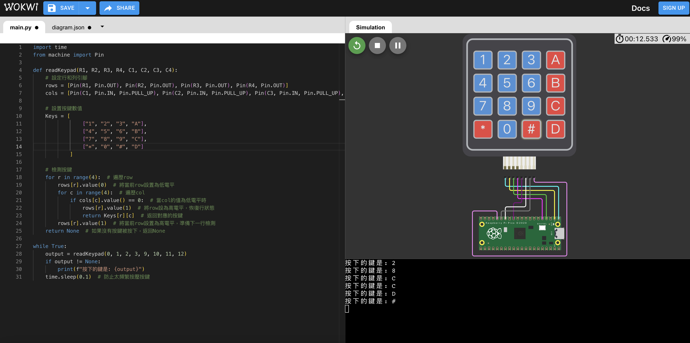
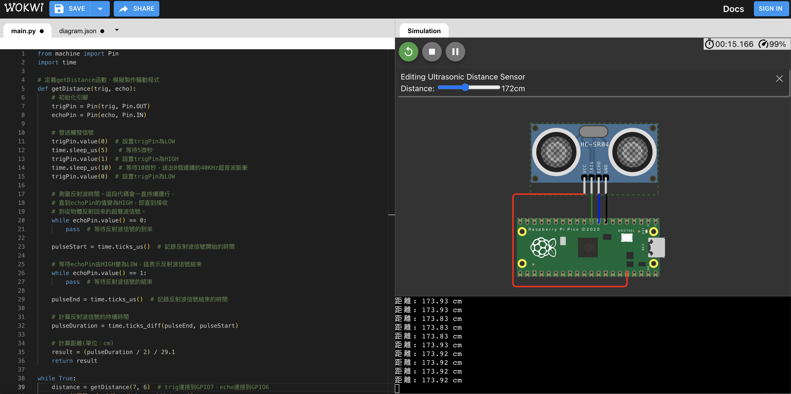

# 課程三

**教學主題：** 製作驅動程式
	
**目的：** 學習驅動程式的概念，來控制元件。

**操作解說：** 這門課程主要包含三個學習重點，分別如下：(需要事先下載與安裝Servo.h函式庫)
1. Read Keypad.py：主要學習定義readKeypad函數，作為Keypad驅動程式。線路配置如下圖所示：
 

	

 

2. Get Distance.py：主要學習定義getDistance函數，作為HC-SR04驅動程式。以下為對應的線路配置圖：(HC-SR04的物理概念，請參照[台南市教育局科技教育網](https://maker.tn.edu.tw/modules/tad_book3/page.php?tbdsn=201))
 

	

 
